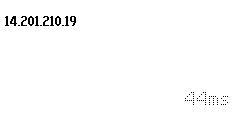
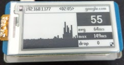

# pi net graph


# Pings google to show current response time on a [2.13inch e-Paper HAT](https://www.waveshare.com/wiki/2.13inch_e-Paper_HAT) attached to a raspberry pi zero w
 

# Setup
- download and install https://www.raspberrypi.org/downloads/raspbian/ on a raspberry pi with 2.13inch e-Paper HAT attached
- Ensure your Raspberry pi is connected to the network you wish to monitor
- Follow [this](https://www.waveshare.com/wiki/2.13inch_e-Paper_HAT#Installing_libraries_required) to install the required drivers and enable appropriate settings in raspbian
- clone the repository with
```
git clone https://github.com/ssaraswati/pinetgraph.git
```
- copy the code to your pi via scp if you have ssh enabled or usb/sd card otherwise
```
scp -r pi@192.168.1.177:~/pynet ./
```
- edit /etc/rc.local to add app.py to startup 
```bash
sudo nano /etc/rc.local
```
```config 
#!/bin/sh -e
#
# rc.local
#
# This script is executed at the end of each multiuser runlevel.
# Make sure that the script will "exit 0" on success or any other
# value on error.
#
# In order to enable or disable this script just change the execution
# bits.
#
# By default this script does nothing.

# Print the IP address
_IP=$(hostname -I) || true
if [ "$_IP" ]; then
  printf "My IP address is %s\n" "$_IP"
fi

python /home/pi/pynet/app.py > /home/pi/pynet/log.txt &
exit 0
```
